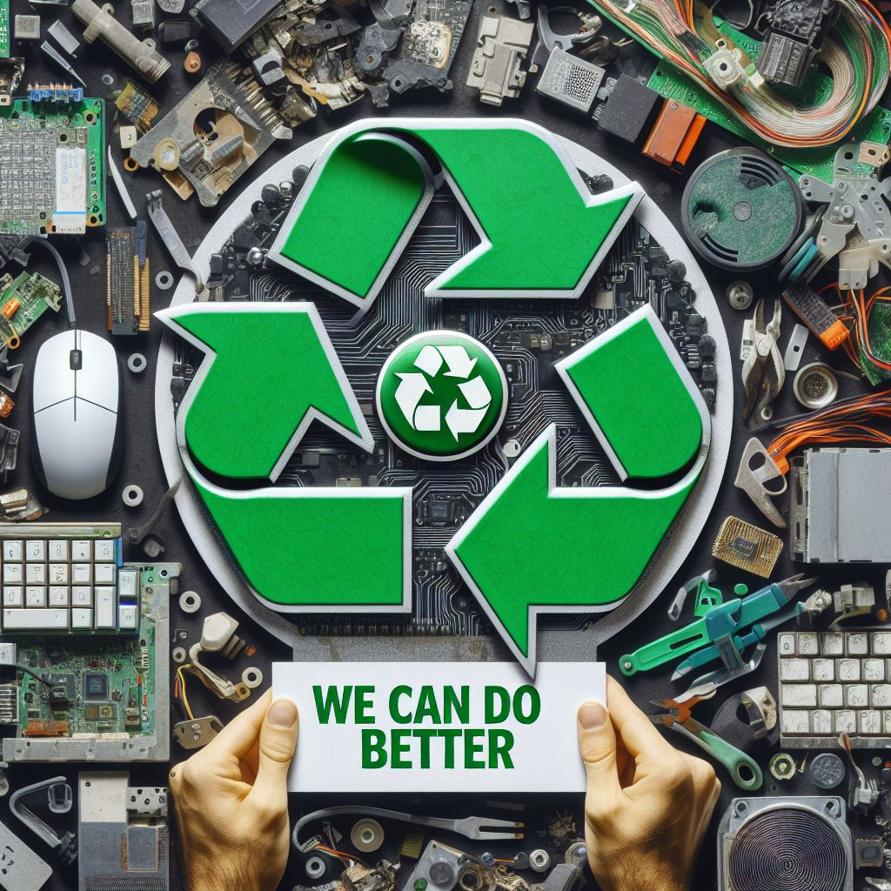

# INFORMATICA ECOLOGICA

**La Informática Ecológica se refiere al uso ambientalmente sostenible en la tecnologica informatica. Esto implica fabricar, diseñar, desechar y utilizar computadoras y recursos relacionados de manera eficiente, con el objetivo de minimizar los impactos negativos en el medio ambiente.**

### OBJETIVOS DE LA INFORMATICA ECOLOGICA
**El objetivo principal es reducir el impacto ambiental, desde la fabricación hasta la disposición final de los dispositivos.**

    * Eficiencia energética y gestión de la energía.
    * Uso de hardware y software ecológicos.
    * Minimizar el uso de sustancias peligrosas.
    * Reciclaje de materiales.
    * Aumentando la vida útil de los dispositivos.

:arrow_right_hook: [GeekFlare] Informatica Ecologica, Objetivos, Impacto que conlleva. https://geekflare.com/es/green-computing-for-sustainable-future/

:arrow_right_hook:[ChatGPT] https://chat.openai.com/